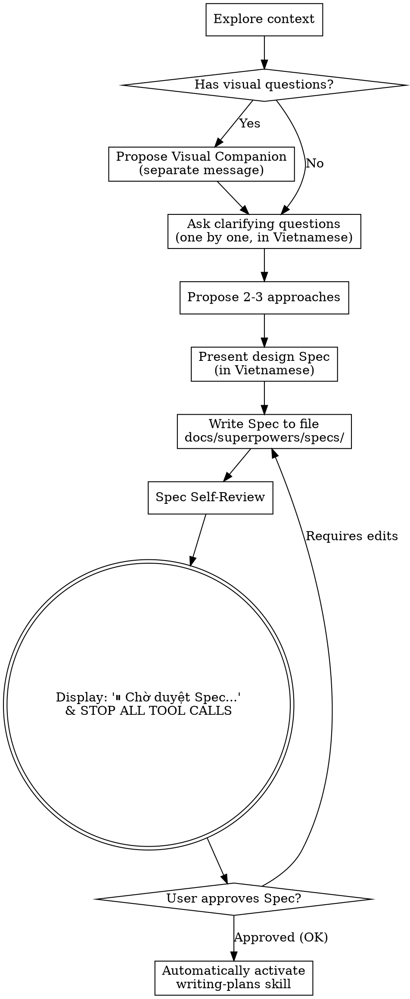

# Brainstorming Ideas Into Designs

Helps turn ideas into complete designs and technical specifications (Specs) through a natural collaborative discussion in **Vietnamese**.

Start by exploring the current project context, then ask one clarifying question at a time. Once you fully understand what needs to be built, present the design specification and get approval from the user.

## The 5-Step Workflow & Strict Gatekeepers (Hard Gates)

You **MUST** strictly adhere to the 5-Step Workflow from `GEMINI.md`:

1. **Brainstorm/Spec**: Use this `brainstorming` skill to analyze requirements, propose solutions, and write a detailed Spec.
2. **Gate 1 (Approve Spec) - HARD GATE**: After brainstorming and presenting the design specification (Spec), you **MUST** display the exact message:
   
   *"⏸️ **Chờ duyệt Spec** — Gõ OK hoặc Duyệt để tiếp tục."*
   
   Then **IMMEDIATELY STOP ALL TOOL CALLS**. Absolutely do not call any tool (including the plan-writing skill `writing-plans`) until the user explicitly responds with approval.
3. **Write Plan**: Upon receiving approval for the Spec from the user, you will AUTOMATICALLY trigger the `writing-plans` skill to generate a detailed implementation plan.
4. **Gate 2 (Approve Plan) - HARD GATE**: After writing the implementation plan, you **MUST** display the exact message:
   
   *"⏸️ **Chờ duyệt Plan** — Gõ OK hoặc Duyệt để tiếp tục."*
   
   Then **IMMEDIATELY STOP ALL TOOL CALLS**. Do not call any tool or transition to execution until the user explicitly responds with approval.
5. **Auto Execution**: Upon receiving approval for the Plan, automatically transition directly into implementation by coordinating subagents (`subagent-driven-development`).

---

<HARD-GATE>
Do not perform any coding actions, create directory structures, or carry out any execution operations until both the Spec and Plan have successfully passed the two Gatekeepers above in sequence.
</HARD-GATE>

## Anti-Pattern: "Too Simple to Need a Design"

Every request, no matter how small or large (e.g., a tiny configuration change, a simple feature), must go through this workflow. "Simple" projects are often where unverified assumptions waste the most effort. The design can be concise for super simple projects, but you MUST present it and get the user's approval.

## Task Checklist (Using `task.md` Artifact)

You **must** track the status of the following items via the artifact file `task.md` at `<artifactDir>/task.md` (do not use `TodoWrite`) and complete them in the exact order:

1. **Explore project context** — inspect files, documentation, recent commits.
2. **Propose Visual Companion** (if the topic is related to interfaces/images) — send this as a separate message, not combined with clarifying questions.
3. **Ask clarifying questions** — ask one question at a time in **Vietnamese**, clarifying purpose, constraints, and success criteria.
4. **Propose 2-3 approaches** — along with pros, cons, and your recommendation.
5. **Present the design Spec** — structured clearly in **Vietnamese** and seek user feedback.
6. **Save Spec** — Save the design specification document to the project's spec directory: `docs/superpowers/specs/YYYY-MM-DD-<topic>-design.md`.
7. **Spec Self-Review** — quickly review for any placeholders, contradictions, or ambiguities.
8. **Gate 1: User approves Spec** — Display the hard gate pause message: *"⏸️ **Chờ duyệt Spec** — Gõ OK hoặc Duyệt để tiếp tục."* and stop all tool calls.
9. **Transition to planning** — After approval, automatically activate the `writing-plans` skill.

## Process Flow

## Detailed Execution Steps

**Understand the Idea:**
* Explore the current codebase first to understand the structure.
* If the scope is too large, propose breaking it down into sub-modules and design the first sub-module first. Each sub-module goes through its own brainstorm/spec -> plan -> execution cycle.
* Ask one question at a time in **Vietnamese**. Prefer multiple-choice questions when possible. Do not overwhelm the user.

**Approaches:**
* Provide 2-3 approaches with specific pros and cons comparisons.
* Recommend the most optimal approach and clearly explain why.

**Present Design Specification (Spec):**
* Present the Spec structure clearly in **Vietnamese**: architecture, components to affect, data flow, error handling, and verification methods (no new tests written unless requested).

**Independent and Clear Design:**
* Deconstruct the system into distinct functional units communicating via defined interfaces. This keeps the system maintainable and prevents file bloat.

**Working on Existing Codebase:**
* Adhere to existing patterns in the project. If refactoring an existing file is necessary for the new feature, include it in the Spec design but avoid unrelated refactoring.

## Saving Design Spec Document
* Write the agreed Spec document to the directory: `docs/superpowers/specs/YYYY-MM-DD-<topic>-design.md`.
* The content of this document must be written entirely in standard **Vietnamese**.

## Spec Self-Review:
Review the spec before presenting it for user approval:
1. **Scan for Placeholders:** Must not contain words like "TBD", "TODO", incomplete or vague sections.
2. **Consistency:** Are there contradictions between the architecture and the description?
3. **Scope Check:** Is the Spec too broad? Does it need to be broken down further?
4. **Clarity:** Are there any phrases that could easily be misunderstood? Standardize and clarify.

## Gate 1: Approve Spec (Hard Gate 1)
After saving the Spec file and performing the self-review, you MUST output the exact pause message:
> "⏸️ **Chờ duyệt Spec** — Gõ OK hoặc Duyệt để tiếp tục."

and **IMMEDIATELY STOP ALL TOOL CALLS**. Wait for the user's response. If the user requests edits, update the Spec, perform self-review, and repeat this gate. When the user types "OK" or "Duyệt", only then do you automatically activate the `writing-plans` skill.

## Visual Companion
*(Same as default guidelines, but communicating entirely in Vietnamese).*
If there are questions related to UI/UX, you may propose activating the Visual Companion with a separate message. If the user agrees, use the browser to display mockups/diagrams; otherwise, communicate via standard terminal text.
