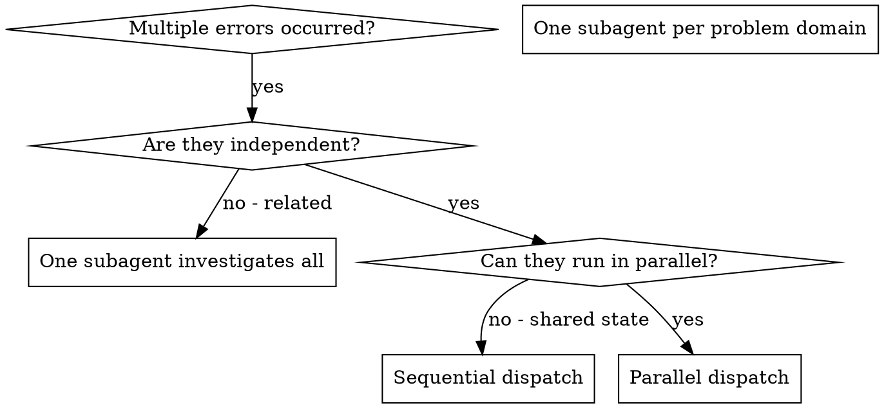

# Dispatching Parallel Agents

## Overview

You delegate tasks to specialized subagents with independent contexts. By setting precise instructions and context for them, you ensure they remain focused and complete their tasks successfully. They never inherit your current session history or context — you only build exactly what they need. This also helps preserve your own context for dispatch coordination.

When you encounter multiple unrelated test failures or system errors in different subsystems, investigating and fixing them sequentially is a waste of time. Each investigation is independent and can fully run in parallel.

**Core Principle:** Dispatch one subagent for each independent problem domain. Let them run concurrently.

## When to Use



**Use when:**
- 3 or more test files are failing with completely different root causes.
- Multiple subsystems are broken independently.
- Each issue can be understood and resolved without context from other issues.
- There is no shared state between investigations or code modifications.

**Do not use when:**
- The errors are closely related (fixing one might automatically fix another).
- Understanding the full system state is required to resolve them.
- Subagents will interfere with or overwrite each other's work (editing the same file or lines of code).

## Execution Model

### 1. Identify Independent Domains

Group test/system failures by what is broken:
- Group A: Tool approval flow test failures.
- Group B: Batch completion behavior test failures.
- Group C: Abort functionality test failures.

Each of these domains is independent — fixing tool approval does not affect abort tests.

### 2. Set Up Focused Subagent Tasks

Each subagent will receive:
- **Specific scope:** A specific test file or subsystem.
- **Clear goal:** Make these tests pass.
- **Constraints:** Do not change other code outside the scope.
- **Expected output:** A detailed summary of what was found and fixed.

### 3. Parallel Dispatch on Antigravity CLI

On Antigravity CLI, the standard method to run subagents in parallel is using the `Subagents` property in a single `invoke_subagent` call.

Sample TypeScript code:

```typescript
// Inside Antigravity CLI / AI environment
invoke_subagent({
  Subagents: [
    {
      TypeName: "self",
      Role: "Fix agent-tool-abort.test.ts",
      Prompt: "Fix the test errors in src/agents/agent-tool-abort.test.ts...",
      Workspace: "branch" // Use isolated workspace instead of manual git worktree
    },
    {
      TypeName: "self",
      Role: "Fix batch-completion-behavior.test.ts",
      Prompt: "Fix the test errors in src/agents/batch-completion-behavior.test.ts...",
      Workspace: "branch"
    },
    {
      TypeName: "self",
      Role: "Fix tool-approval-race-conditions.test.ts",
      Prompt: "Fix the test errors in src/agents/tool-approval-race-conditions.test.ts...",
      Workspace: "branch"
    }
  ]
});
// All 3 subagents will run in parallel, completely independent and safe
```

> [!TIP]
> Use the `Workspace: "branch"` property when calling subagents to leverage the automatic workspace isolation feature of Antigravity CLI. This is much safer and cleaner than running manual `git worktree` commands.

### 4. Review and Integrate

When the subagents complete and respond:
- Carefully read each subagent's summary.
- Verify that fixes do not conflict with each other.
- Run the full test suite to ensure consistency.
- Integrate all changes into the main development branch.

## Sample Subagent Prompt Structure

A good prompt for parallel subagents must ensure:
1. **Focus** - Only one clear problem domain.
2. **Self-contained** - Provide enough context to understand the issue without external reading.
3. **Specific output** - Clearly ask what information the subagent should return.

```markdown
Fix 3 failing tests in src/agents/agent-tool-abort.test.ts:

1. "should abort tool with partial output capture" - expects 'interrupted at' in the error message.
2. "should handle mixed completed and aborted tools" - fast-running tool gets aborted instead of completed.
3. "should properly track pendingToolCount" - expects 3 results but received 0.

These issues are related to timing/race conditions. Your tasks:

1. Read the test file and understand what each test verifies.
2. Identify the root cause - is it due to timing or an actual bug?
3. Fix by:
   - Replacing arbitrary timeouts with event-based waiting mechanisms.
   - Fixing the abort implementation if bugs are found.
   - Adjusting test expectations if the behavioral change is acceptable.

DO NOT blindly increase timeouts — find and fix the real issue.
TESTING WARNING: Do not write new tests, focus only on fixing the existing failing tests.

Returned output: Summarize the root cause and what you fixed in Vietnamese.
```

## Common Mistakes

**❌ Too broad:** "Fix all test errors in the project" - the subagent will get lost.
**✅ Specific:** "Fix agent-tool-abort.test.ts errors" - clear, focused scope.

**❌ No context:** "Fix the race condition" - the subagent doesn't know where it occurs.
**✅ Context:** Provide detailed error messages and names of the failing tests.

**❌ No constraints:** The subagent might arbitrarily refactor the entire project.
**✅ Constraints:** "Only modify the test file" or "Do not change production code structure".

**❌ Vague output:** "Fixed it" - you don't know what was changed.
**✅ Specific request:** "Return a summary of root causes and changes made."

## Core Benefits

1. **Parallelization** - Multiple investigations and fixes happen concurrently.
2. **Focus** - Each subagent has a narrow scope with less context to track.
3. **Independence** - Subagents do not interfere with each other thanks to `Workspace: "branch"`.
4. **Speed** - Resolve 3 major issues in the same time it takes to resolve 1.

## Verification

After subagents respond:
1. **Evaluate each summary** - Clearly understand what was changed.
2. **Check for conflicts** - Did any subagents modify the same lines of code?
3. **Run the full test suite** - Ensure all solutions work harmoniously together.
