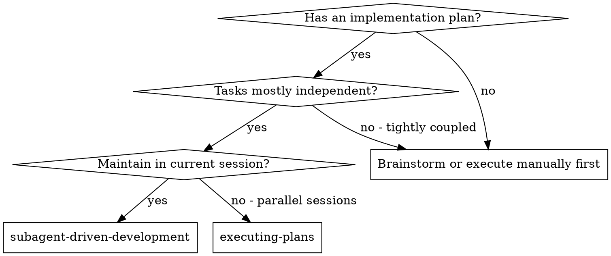
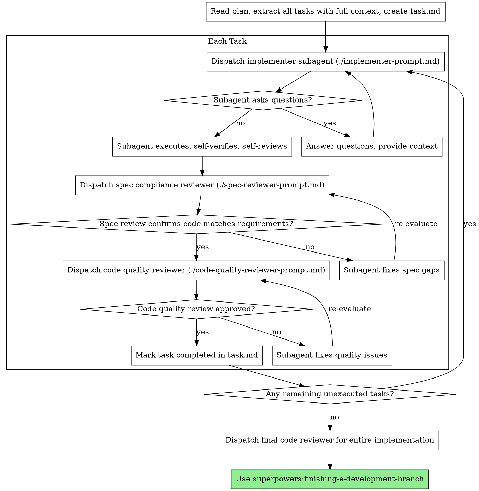

# Subagent-Driven Development

Execute the plan by coordinating a new subagent for each task, accompanied by a two-stage review process after each task: first a specification compliance review, and then a code quality review.

**Why use subagents:** You delegate tasks to specialized subagents with isolated context. By establishing precise instructions and context for them, you ensure they remain focused and complete their tasks successfully. They never inherit your current session's context or history — you construct exactly what they need. This also helps preserve your own context for coordination.

**Core Principle:** A new subagent for each task + a two-stage review process (specification first, quality second) = high quality, fast iteration.

**Continuous Execution:** Do not pause to ask for user input between tasks unless truly blocked.

**Platform Notes:** On Antigravity CLI, use `invoke_subagent` / `define_subagent` instead of the `Task` tool. Use the artifact `task.md` instead of `TodoWrite`. See `using-superpowers/references/antigravity-tools.md` for the full mapping table. Execute all tasks from the plan without stopping. The only reasons to stop are: a BLOCKED state that you cannot resolve, true ambiguity that prevents progress, or all tasks are completed. Questions like "Should I continue?" and progress summaries waste the user's time — they asked you to execute the plan, so focus on doing it.

## When to Use



**Compared to executing plans (executing-plans in parallel sessions):**
- Same workspace session (no context switching)
- A new subagent for each task (no context contamination)
- Two-stage review after each task: specification compliance first, then code quality
- Faster iteration (no user intervention required between tasks)

## Execution Process



## Subagent Discovery Process

Before defining a subagent using `define_subagent`, you must check the `.gemini/antigravity-ide/agents` directory for a `<name>.md` file:
1. Check if the agent configuration file `<name>.md` exists in the `.gemini/antigravity-ide/agents` directory.
2. If found, parse its `description` and `tools` to enable the appropriate write file, subagent, or MCP tool permissions, then launch the subagent using that configuration.
3. If no agent configuration exists, ask the user to create a new definition file or proceed with a suitable temporary configuration.

## Language and Testing Requirements

- **Language:** All subagents must communicate and respond fully in **Vietnamese**. The context and communication instructions are conveyed clearly and coherently.
- **Strict Test-Writing Policy:**
  - **Do NOT write new tests** unless the user explicitly requests it (e.g., specific requests like "write tests", "TDD", "add unit tests").
  - If writing tests is not requested, verify the product by building, linting, typechecking, checking logs, or running cheap existing test suites.
  - The plan must explicitly state the mandatory test statement: *"Không viết test mới vì người dùng không yêu cầu."*

## Managing Subagent Execution States

The executing subagent will report one of four statuses. Handle them appropriately:

**DONE:** Proceed to specification compliance review.

**DONE_WITH_CONCERNS:** The subagent completed the work but noted some concerns. Read them carefully before proceeding. If the concerns relate to correctness or scope, resolve them before review. If they are general observations (e.g., "this file is getting too large"), acknowledge them and proceed with the review.

**NEEDS_CONTEXT:** The subagent needs additional information that was not provided. Provide more context and re-dispatch.

**BLOCKED:** The subagent cannot complete the task. Assess the cause of the blockage:
1. If due to lack of context, provide additional context and re-dispatch.
2. If the task requires higher reasoning capabilities, re-dispatch with a stronger model.
3. If the task is too large, break it down into smaller parts.
4. If the plan itself is incorrect, communicate directly with the user to adjust.

**Absolutely do not** ignore blocked feedback or force a re-run without making any changes.

## Prompt Templates

- `./implementer-prompt.md` - Template for coordinating implementer subagent
- `./spec-reviewer-prompt.md` - Template for coordinating spec compliance reviewer subagent
- `./code-quality-reviewer-prompt.md` - Template for coordinating code quality reviewer subagent

## Example Real Walkthrough

```
You: I am using Subagent-Driven Development to execute this plan.

[Reads the plan file once: docs/plans/feature-plan.md]
[Extracts all 5 tasks with full text and context]
[Creates task.md artifact containing all tasks]

Task 1: Embed installation hook

[Retrieves text and context of Task 1]
[Dispatches implementer subagent with full task text + context]

Subagent: "Before I begin - should the hook be installed at the user or system level?"

You: "User level (~/.config/superpowers/hooks/)"

Subagent: "Understood. Proceeding with implementation..."
[Later] Subagent:
  - Implemented the install-hook command
  - Self-review: Noticed missing --force flag, added it
  - Status: DONE

[Dispatches spec compliance reviewer]
Spec reviewer: ✅ Spec compliant - fully meets requirements, nothing more, nothing less

[Dispatches code quality reviewer]
Code reviewer: Strengths: Clean, readable syntax. Issues: None. Approved.

[Marks Task 1 completed in task.md]

Task 2: Repair mode

[Retrieves text and context of Task 2]
[Dispatches implementer subagent with full task text + context]

Subagent: [No questions, proceeds with execution]
Subagent:
  - Added verify/repair mode
  - Self-review: Everything is stable
  - Status: DONE

[Dispatches spec compliance reviewer]
Spec reviewer: ❌ Issues detected:
  - Missing: Progress reporting (specification requested "report every 100 items")
  - Redundant: Added --json flag (not requested)

[Subagent fixes these issues]
Subagent: Removed --json flag, added progress reporting.

[Spec reviewer runs again]
Spec reviewer: ✅ Spec compliant

[Dispatches code quality reviewer]
Code reviewer: Strengths: Robust. Issues (Important): Magic number (100) used directly.

[Subagent modifies]
Subagent: Extracted to PROGRESS_INTERVAL constant.

[Code quality reviewer runs again]
Code reviewer: ✅ Approved

[Marks Task 2 completed in task.md]

...

[After completing all tasks]
[Dispatches final code quality reviewer]
Final reviewer: Meets all integration requirements, ready to merge.

Complete!
```

## Behaviors to Avoid (Red Flags)

**Absolutely do not:**
- Start implementation on the main branch (main/master) without explicit user consent.
- Skip review steps (either spec compliance OR code quality).
- Proceed to the next task when detected issues have not been fully resolved.
- Dispatch multiple implementer subagents in parallel on resources prone to conflict (unless designed independently and run in parallel using the `dispatching-parallel-agents` process).
- Force the subagent to read the plan file itself (provide them with full text and context).
- Ignore context setup around the task.
- Ignore subagent questions (answer them before allowing them to proceed).
- Accept "close enough" compliance with the specification.
- **Start code quality review before the spec compliance review reaches ✅** (wrong order).

## Process Integration

**Mandatory process skills:**
- **superpowers:using-git-worktrees** - Ensures independent workspace (use Workspace: "branch" on Antigravity CLI)
- **superpowers:writing-plans** - Creates the plan this skill will execute
- **superpowers:requesting-code-review** - Review template for code quality reviewer
- **superpowers:finishing-a-development-branch** - Finalizes development after all tasks are completed
